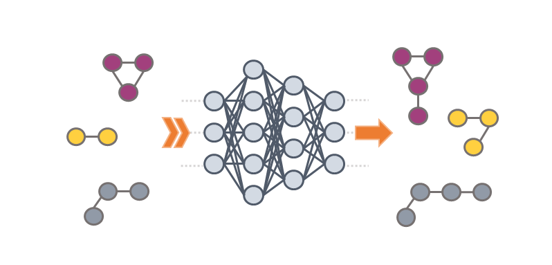

# GraphINVENT



## Description
GraphINVENT is a platform for graph-based molecular generation using graph neural networks. GraphINVENT uses a tiered deep neural network architecture to probabilistically generate new molecules a single bond at a time. All models implemented in GraphINVENT can quickly learn to build molecules resembling training set molecules without any explicit programming of chemical rules. The models have been benchmarked using the MOSES distribution-based metrics, showing how the best GraphINVENT model compares well with state-of-the-art generative models.

## Updates
The following versions of GraphINVENT exist in this repository:
* v1.0 (and all commits up to here) is the label corresponding to the "original" version, and corresponds with the publications below.
* v2.0 is an updated version, created March 10, 2021.

*26-03-2021*:
Small update: you should now be able to use pre-trained models created with GraphINVENT v1.0 with v2.0.

*10-03-2021*:

The biggest changes in v2.0 from v1.0 are summarized below:
* Data preprocessing was updated for readibility (now done in `DataProcesser.py`).
* Graph generation was updated for readibility (now done in `Generator.py`), as well as some bugs related to how implicit Hs and chirality were handled on the GPU (not used before, despite being available for preprocessing/training).
* Data analysis code was updated for readibility (now done in `Analyzer.py`).
* The learning rate decay scheme was changed from a custom learning rate scheduler to the OneCycle scheduler (so far, it appears to be working well enough, and with a reduced set of parameters).
* The code now runs using the latest version of PyTorch (1.8.0); the previous version was running using PyTorch 1.3. The environment has correspondingly been updated (and renamed "GraphINVENT-env" -> "graphinvent").
* Redundant hyperparameters were removed; additionally, hyperparameters seen not to improve things were removed from `defaults.py`, such as the optimizer weight decay (now just 0.0) and weights initialization (fixed to Xavier uniform now).
* Some old functions, such as `models.py` and `loss.py` were consolidated into `Workflow.py`.
* A validation loss calculation was added to keep track of model training.

Additionally, minor typos and bugs were corrected, and the docstrings and error messages updated. Examples of minor bugs/changes:
* Bug in how fraction properly terminated graphs (and fraction valid of properly terminated) was calculated (wrong function for data type, which led to errors in rare instances).
* Errors in how analysis histograms were written to tensorboard; these were also of questionable utility so are now simply removed.
* Some values (like the "NLL diff") were removed, as they were also not found to be useful.

If you spot any issues (big or small) since the update, please create an issue or a pull request (if you are able to fix it), and we will be happy to make changes.

## Prerequisites
* Anaconda or Miniconda with Python 3.6 or 3.8.
* CUDA-enabled GPU.

## Instructions and tutorials
For detailed guides on how to use GraphINVENT, see the [tutorials](./tutorials/).

## Examples
An example training set is available in [./data/gdb13_1K/](./data/gdb13_1K/). It is a small (1K) subset of GDB-13 and is already preprocessed.

## Contributors
[@rociomer](https://www.github.com/rociomer)

[@rastemo](https://www.github.com/rastemo)

[@edvardlindelof](https://www.github.com/edvardlindelof)

## Contributions

Contributions are welcome in the form of issues or pull requests. To report a bug, please submit an issue. Thank you to everyone who has used the code and provided feedback thus far.


## References
### Relevant publications
If you use GraphINVENT in your research, please reference our [publication](https://doi.org/10.1088/2632-2153/abcf91).

Additional details related to the development of GraphINVENT are available in our [technical note](https://doi.org/10.1002/ail2.18). You might find this note useful if you're interested in either exploring different hyperparameters or developing your own generative models.

The references in BibTex format are available below:

```
@article{mercado2020graph,
  author = "Rocío Mercado and Tobias Rastemo and Edvard Lindelöf and Günter Klambauer and Ola Engkvist and Hongming Chen and Esben Jannik Bjerrum",
  title = "{Graph Networks for Molecular Design}",
  journal = {Machine Learning: Science and Technology},
  year = {2020},
  publisher = {IOP Publishing},
  doi = "10.1088/2632-2153/abcf91"
}

@article{mercado2020practical,
  author = "Rocío Mercado and Tobias Rastemo and Edvard Lindelöf and Günter Klambauer and Ola Engkvist and Hongming Chen and Esben Jannik Bjerrum",
  title = "{Practical Notes on Building Molecular Graph Generative Models}",
  journal = {Applied AI Letters},
  year = {2020},
  publisher = {Wiley Online Library},
  doi = "10.1002/ail2.18"
}
```

### Related work
#### MPNNs
The MPNN implementations used in this work were pulled from Edvard Lindelöf's repo in October 2018, while he was a masters student in the MAI group. This work is available at

https://github.com/edvardlindelof/graph-neural-networks-for-drug-discovery.

His master's thesis, describing the EMN implementation, can be found at

https://odr.chalmers.se/handle/20.500.12380/256629.

#### MOSES
The MOSES repo is available at https://github.com/molecularsets/moses.

#### GDB-13
The example dataset provided is a subset of GDB-13. This was obtained by randomly sampling 1000 structures from the entire GDB-13 dataset. The full dataset is available for download at http://gdb.unibe.ch/downloads/.


## License

GraphINVENT is licensed under the MIT license and is free and provided as-is.

## Link
https://github.com/MolecularAI/GraphINVENT/
